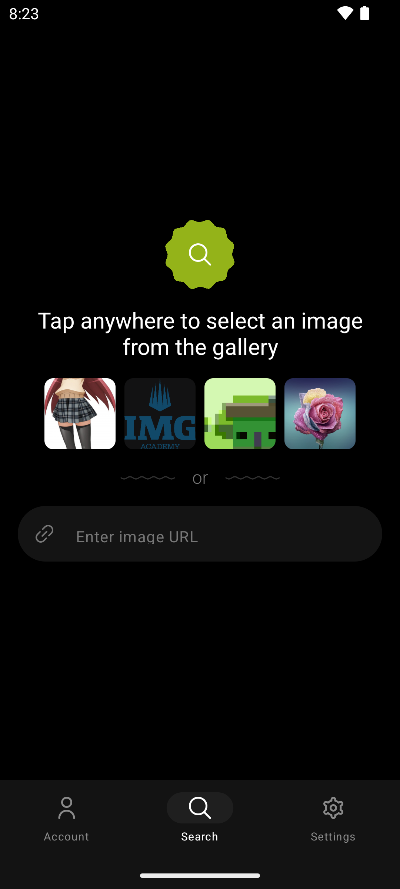
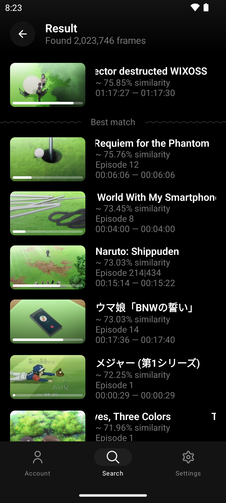
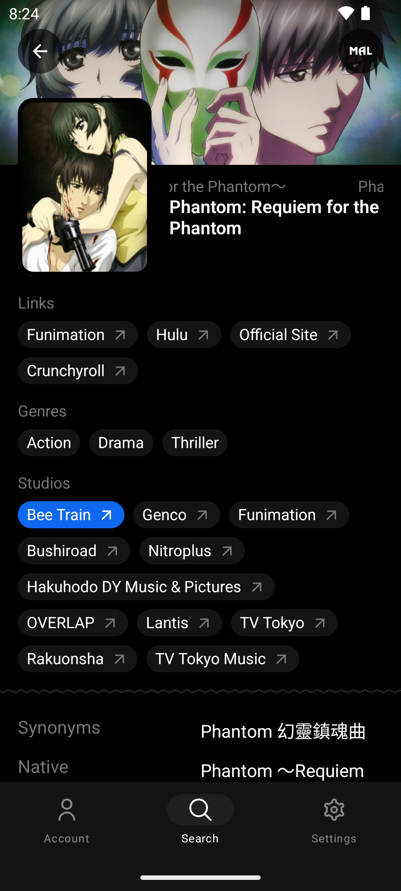
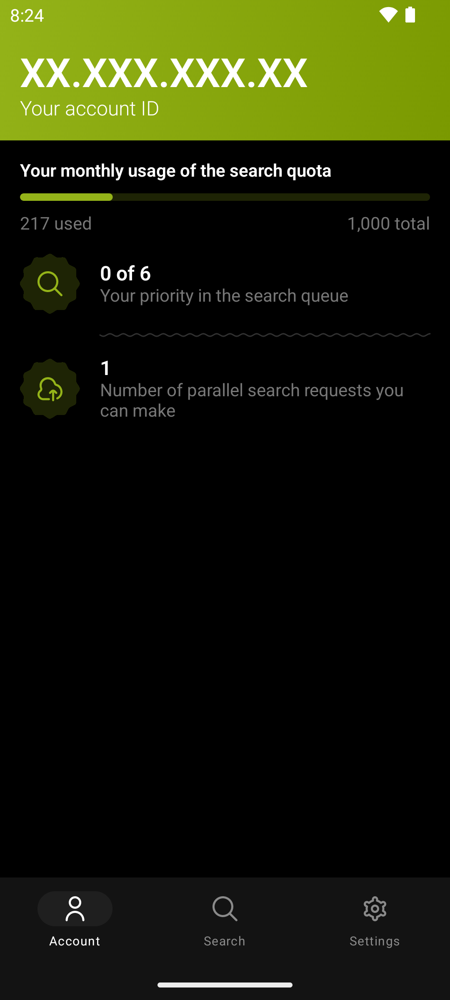

   
  

<h1 align="center">trace.moe</h1>

Application based on trace.moe API with the search by the anime frame

    
    
    
    

# Download

Go to the [Releases](https://github.com/localhostov/trace.moe-app/releases/latest) and download latest apk.

 